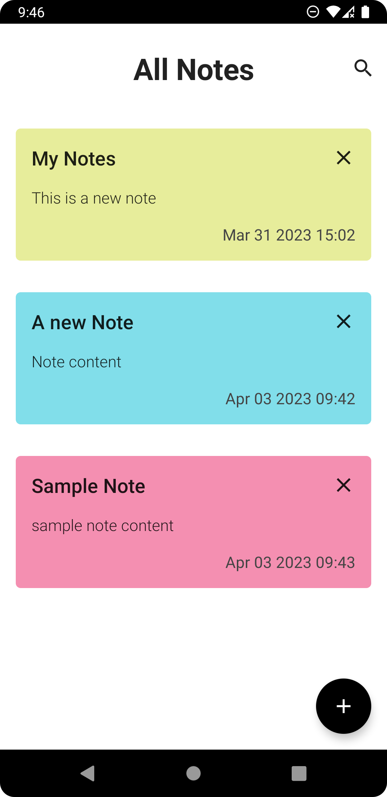
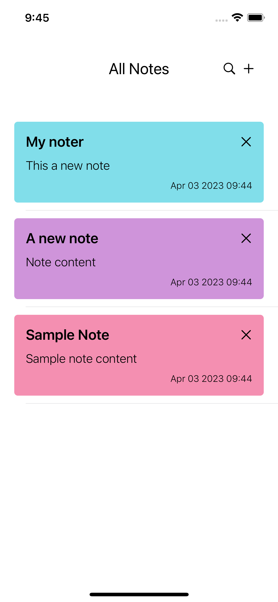

# Note App

This is a note app that uses Kotlin Multiplatform Mobile (KMM) to share code between Android and iOS platforms. It allows users to create, edit and delete notes on their devices.

## Screenshots

### Android

  

### iOS

  


## Technologies and Frameworks

This project uses the following technologies and frameworks:

- **Android Module**: This module contains the Android-specific code and UI for the note app. It uses:
  - *Hilt*: A dependency injection library that helps reduce boilerplate code and improve testability.
  - *Jetpack Compose*: A modern toolkit for building native Android UIs with declarative Kotlin code.
  
- **Shared Module**: This module contains the common logic and data models for the note app. It uses:
  - *Kotlin*: A cross-platform, statically typed, general-purpose programming language with type inference.
  - *SqlDelight*: A library that generates type-safe Kotlin APIs from SQL queries.
  
- **iOS Module**: This module contains the iOS-specific code and UI for the note app. It uses:
  - *SwiftUI*: A framework that provides a declarative way to build user interfaces across Apple platforms.

## How to run

To run this project, you need to have Android Studio and Xcode installed on your machine. You also need to clone this repository from GitHub:

```bash
git clone https://github.com/tolgaprm/NoteAppKMM
